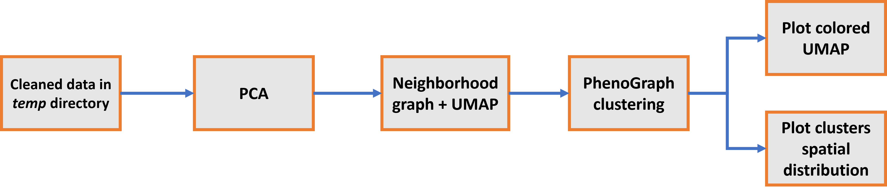

# PhenoGraph clustering project  
This project implements PhenoGraph as clustering method for Single-Cell measurements.  
Once provided both the measurements dataset and the spatial coordinates of the cells, this script will perform the necessary steps to generate a spatial representation of the cells clusters.
The image below summarizes the steps that make up the process.
  

## Pre-requisites  
To run this code, install in your environment the following libraries.  
`anndata scanpy numpy pandas pathlib plotly datetime configparser uuid`  
  
## Testing  
To perform the testing routine, when in the main directory of this project run `pytest testing.py` from your python console. The following tests will be performed:  
- *test_source_data_reading*: verify proper functionality of I/O functions  
- *test_clustering_reproducibility*: verify whether two identical executions of the clustering process provide the same result  
- *test_clustering_reliability*: verify proper functionality of clustering process by comparing results with the expected outcome  
On an average laptopt, this routine might require approximately 2 minutes.  

## How to run the code  
Following these instructions you may run the code without performing any adaptation. All user parameters can be customized inside an external configuration file.  

First, verify that your input data is structured as expected, and tune the [configuration.txt](./configuration.txt) file according to your needs.
Once done,you will have two options:  
- run the [clustering.py](./clustering.py) file from your python console  
- explore the effect of the single functions with the interactive [demo_notebook.ipynb](./demo_notebook.ipynb)  

Both implementations contain the same procedure, thus providing equivalent results.  
Check messages and results appearing in the console during execution. All plots shown will be saved inside the *figures* directory you selected.  

### Structure of input data  
The program expects **two** .csv files:  
- **One file containing data on single-cell measurements**.  
The document should contain comma separated columns and be organized as: first column as cell number, one row for each cell, one more column for each feature.  
For example:  

|     | CD14C01CD16C02HL  | CD14C01CD16C02HLA | CD1aC01SynCAMC02RB | ... |
|:---:|:-----------------:|:-----------------:|:------------------:|:---:|
|  1  | 0.145321181994838 |  -0.7427901168535 |   0.8510099217044  |     |
|  2  | 0.009652348004606 |  0.14785165558968 |  -1.0977624202569  |     |
|  3  | 1.254862485568716 |  0.25684126698538 |  -0.0489567128639  |     |
| ... |                   |                   |                    |     |  

- **Another file containing the spatial coordinates of each cell**.  
The document should contain three comma-separated columns (without any header) describing: cell number, x coordinate, y coordinate.  
For example:  

|      |     |     |
|:----:|:---:|:---:|
|   1  |  5  | 7.5 |
|   2  |  8  |  7  |
|   3  | 5.2 |  7  |
|  ... |     |     |  

Cell number must have exact correspondence in both files (i.e. cell number 1 in measurements file should correspond to cell number 1 in coordinates file). Hence both files should contain the same amount of cells.  

### Parameters in *configuration.txt*  
**[paths]**  
*data_source* -> Path of .csv file containing single-cell measurements. 
 
*coordinates_source* -> Path of .csv file containing cells' coordinates.  

*figures_dir* -> Path where output figures will be stored (automatically created if not existing).  

*temp_dir* -> Path where output temporary files will be stored (automatically created if not existing). 
  
**[scanpy_figures]**  
Parameters listed in this category will be provided to the *scanpy.set_figure_params* method. 
  
**[scanpy_PCA]**  
*n_comps* -> Number of components obtained from PCA. Possible values: **0** (mantain all the components available - no reduction), any **n>0** (reduce *to* n components), any **n<0** (reduce *by* n dimensions from the maximum number of available components). Indeed, this value must not exceed the effective number of components available.  

*init_seed* -> Initial seed for the computation.  

**[scanpy_NEIGHBORS]**  
*n_comps* -> Number of components obtained from neighborhood graph. Possible values: **0** (mantain all the components available - no reduction), any **n>0** (reduce *to* n components), any **n<0** (reduce *by* n dimensions from the maximum number of available components). Indeed, this value must not exceed the effective number of components available.  

*n_neighbors* -> Number of nearest neighbors.  

*init_seed* -> Initial seed for the computation.  
  
**[scanpy_UMAP]**  
*n_comps* -> Number of components obtained from UMAP. Possible values: **0** (mantain all the components available - no reduction), any **n>0** (reduce *to* n components), any **n<0** (reduce *by* n dimensions from the maximum number of available components). Indeed, this value must not exceed the effective number of components available.  

*init_seed* -> Initial seed for the computation.  
  
**[scanpy_PHENOGRAPH]**  
*clustering_algo* -> Clustering algorithm, whether 'louvain' or 'leiden'.  

*n_neighbors* -> Number of nearest neighbors.  

*n_jobs* -> Number of threads (multiprocessing).  

**[scanpy_PCA_plot]**  
Parameters listed in this category will be provided to the *sc.pl.pca* method.  

**[scanpy_UMAP_plot]**  
Parameters listed in this category will be provided to the *sc.pl.umap* method. 
  
**[scanpy_CLUSTERS_plot]**  
Parameters listed in this category will be provided to the *fig.update_layout* method.  
   
## Tips  
### Foresee backing up results at intermediate stages of the process  
With the current implementation, results obtained at each intermediate step might get lost in case of accidental/unexpected interruption before the complete execution of the process.
To mitigate that risk, after each step you may add the line (currently present only at the end):  
`filename = data_IO.WRITE_ADATA(adata, filename, temp_dir)`  
This would allow you to store newly obtained results by overwriting the work dataset inside *temp* directory. At any time, you will be able to retrieve such file and continue the execution of the process from where you left off.
To re-import a specific work dataset (check its filename) run:  
`adata = data_IO.READ_ADATA(filename, temp_dir)`  

### Possible warning messages  
- "*[ImplicitModificationWarning: Transforming to str index.](https://anndata.readthedocs.io/en/latest/anndata.ImplicitModificationWarning.html)*" warning message is related to the conversion to str type of the database indices. This does not impact the proper functioning of the program.  
  
## References  
Check the following references for more details on the parameters available in each function.  

  
Principal component analysis (PCA):  
https://scanpy.readthedocs.io/en/stable/generated/scanpy.tl.pca.html  
Uniform Manifold Approximation and Projection for Dimension Reduction (UMAP):  
https://scanpy.readthedocs.io/en/stable/generated/scanpy.tl.umap.html  
PhenoGraph:  
https://scanpy.readthedocs.io/en/stable/generated/scanpy.external.tl.phenograph.html  
  
Plotting PCA results:  
https://scanpy.readthedocs.io/en/stable/generated/scanpy.pl.pca.html  
Plotting UMAP results:  
https://scanpy.readthedocs.io/en/stable/generated/scanpy.pl.umap.html